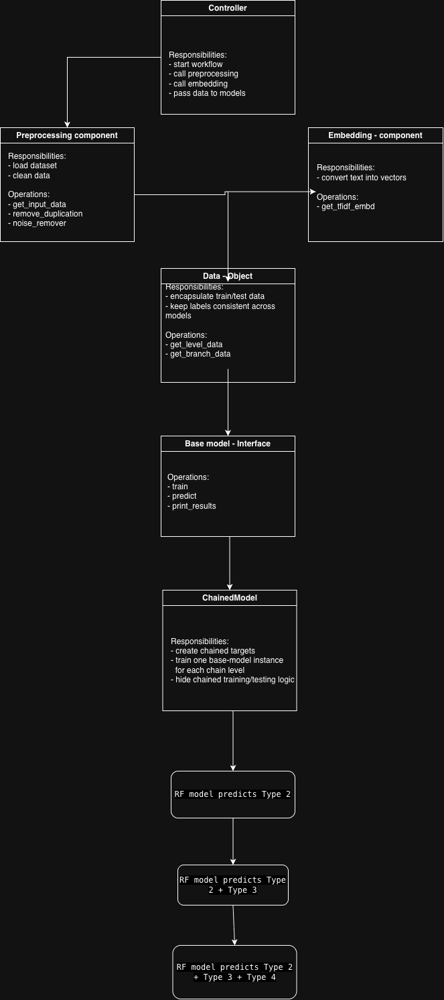
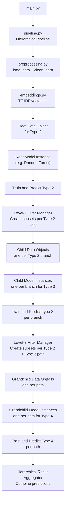
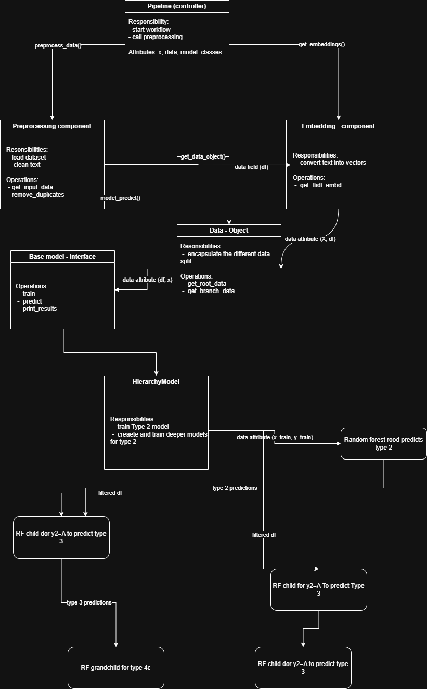

# Code Implementation of Agile Standards

This project implements agile standards in code.

**Authors:** Adewole Adekunle and George Akpovwovwo

## Model Architectures

### Chained Model Architecture

Key components:

- Controller (`main.py` / `pipeline.py`)
- Preprocessing (`preprocessing.py`): load, clean, deduplicate
- Chained target builder: `L1 = y2`, `L2 = y2 + y3`, `L3 = y2 + y3 + y4`
- Embeddings (`embeddings.py`): TF-IDF vectorization
- Data object (`data_loader.py`): encapsulate train/test splits and chain levels
- Models (`model/*.py`): uniform `train`/`predict`/`print_results` interface

### Chained Model Processing View

This workflow describes the data and model pipeline steps in plain markdown:

1. Raw CSV files (`AppGallery.csv`, `Purchasing.csv`) are loaded and merged.
2. Preprocessing removes duplicates and text noise.
3. Chained targets are created:
   - `L1 = y2`
   - `L2 = y2 + y3`
   - `L3 = y2 + y3 + y4`
4. Email text is vectorized via TF-IDF embeddings.
5. Data is split into train and test once for all chained levels.
6. A consistent data object is passed to each model implementation.
7. Models are trained and evaluated on `L1`, `L2`, and `L3`.

### Hierarchical Model Architecture

This workflow represents the hierarchy process flow:

1. Load and clean raw data from `AppGallery.csv` and `Purchasing.csv`.
2. Create feature vectors with TF-IDF (`embeddings.py`).
3. Train root model on `y2` (Type 2) with full dataset (`pipeline.py`, `data_loader.py`).
4. For each predicted/actual `y2` class, filter data into branch subsets for Type 3.
5. Train branch models on `y3` within each `y2` segment.
6. For each `y2`+`y3` path, filter data further for Type 4.
7. Train grandchild models on `y4` within each hierarchical path.
8. Aggregate predictions through root → child → grandchild into final hierarchical output.

Key components:

- Controller (`main.py` / `pipeline.py`)
- Preprocessing (`preprocessing.py`): load, clean, deduplicate
- Embeddings (`embeddings.py`): TF-IDF vectorization
- Hierarchy manager: root model for `y2`, branch models for `y3`, path models for `y4`
- Data object(s): encapsulate route-dependent train/test subsets
- Models (`model/*.py`): consistent interface with `train`/`predict`/`print_results`