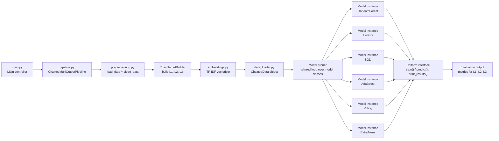
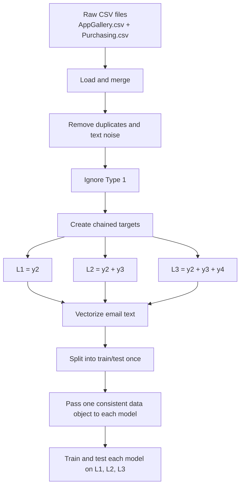

# Task 1: Design Sketch for Design Choice 1

## Goal
Design a chained multi-output architecture for the current email classification project.

This design extends the current codebase so that:

- `Type 1` is ignored because each CSV file contains only one `Type 1` class.
- the system predicts three chained targets derived from `Type 2`, `Type 3`, and `Type 4`
- preprocessing remains independent from modeling
- all models continue to use one consistent data object and one consistent model interface

## Current Project Baseline
The current project already provides the main building blocks:

- `preprocessing.py`: loading, deduplication, text cleaning
- `embeddings.py`: TF-IDF vectorization
- `data_loader.py`: encapsulated train/test data object
- `model/*.py`: model implementations behind a shared abstract interface
- `pipeline.py`: controller

At present, the controller only predicts `Type 2` through `Config.CLASS_COL = 'y2'`.

## Design Choice 1
Instead of training separate hierarchical model instances per parent class, this design creates chained labels from the dependent variables:

1. `L1 = Type 2`
2. `L2 = Type 2 + Type 3`
3. `L3 = Type 2 + Type 3 + Type 4`

Example for one record:

- `L1`: `Suggestion`
- `L2`: `Suggestion + Refund`
- `L3`: `Suggestion + Refund + Subscription cancellation`

The same model family is then evaluated on all three chained targets.

## Sketch

## Processing View

## How This Fits the Existing Code
The design can be implemented with minimal architectural change because the project already follows the required ideas.

- Separation of concerns already exists:
  - preprocessing is outside the model classes
  - vectorization is outside preprocessing and models
  - model control is centralized in the pipeline
- Encapsulation already exists:
  - `Data` can be extended into a chained-label data object without changing individual model code much
- Abstraction already exists:
  - all models already expose `train()`, `predict()`, and `print_results()`

## Proposed Component Roles for This Design
- `main.py`
  - starts the controller
- `pipeline.py`
  - coordinates the end-to-end chained workflow
- `preprocessing.py`
  - loads CSV files and cleans raw text
- `chain_target_builder.py` or helper inside `preprocessing.py`
  - creates `L1`, `L2`, and `L3`
- `embeddings.py`
  - converts text into numeric features once per dataset/group
- `data_loader.py`
  - stores `X_train`, `X_test`, and the three target pairs
- `model/base.py`
  - enforces the common interface
- `model/*.py`
  - keeps model-specific training and prediction logic hidden from the controller
- `results` module or pipeline output
  - reports accuracy for chained target levels

## Key Design Decision
The controller should not know how each model trains or predicts, and it should not rebuild input formats per model.

So the controller should work like this:

1. preprocess once
2. build chained labels once
3. vectorize once
4. package data once
5. loop through models using the same interface
6. evaluate each model on the three chained outputs

## Why This Sketch Matches Task 1
This sketch satisfies the assignment requirement for Design Choice 1 because it shows:

- the chained-label idea
- the main architectural flow
- the separation between preprocessing and modeling
- the reuse of a common data object
- the use of abstraction so all models are accessed uniformly

## Task 1 Compliance Check
This document fully addresses Task 1, "Design a Sketch for Design Choice 1", because it explicitly includes the required design points:

- `Type 1` is excluded from classification because each CSV file has one fixed `Type 1` value
- the architecture is for `Design Choice 1`, not hierarchical modeling
- one model family is assessed on three chained outputs:
  - `Type 2`
  - `Type 2 + Type 3`
  - `Type 2 + Type 3 + Type 4`
- the controller accesses preprocessing and modeling as separate concerns
- the same input representation is reused across models
- all model implementations remain behind the same abstract interface

## Submission-Ready Task 1 Statement
Design Choice 1 uses a chained multi-output architecture. After loading and preprocessing the email data, the system ignores `Type 1` and creates three chained targets: `Type 2`, `Type 2 + Type 3`, and `Type 2 + Type 3 + Type 4`. The controller then generates one common feature representation from the email text, packages the training and testing data into one consistent data object, and sends that object to each ML model through the same abstract interface. This design preserves modularity, keeps input formatting consistent across models, and allows the effectiveness of each model to be assessed at each chain level.
